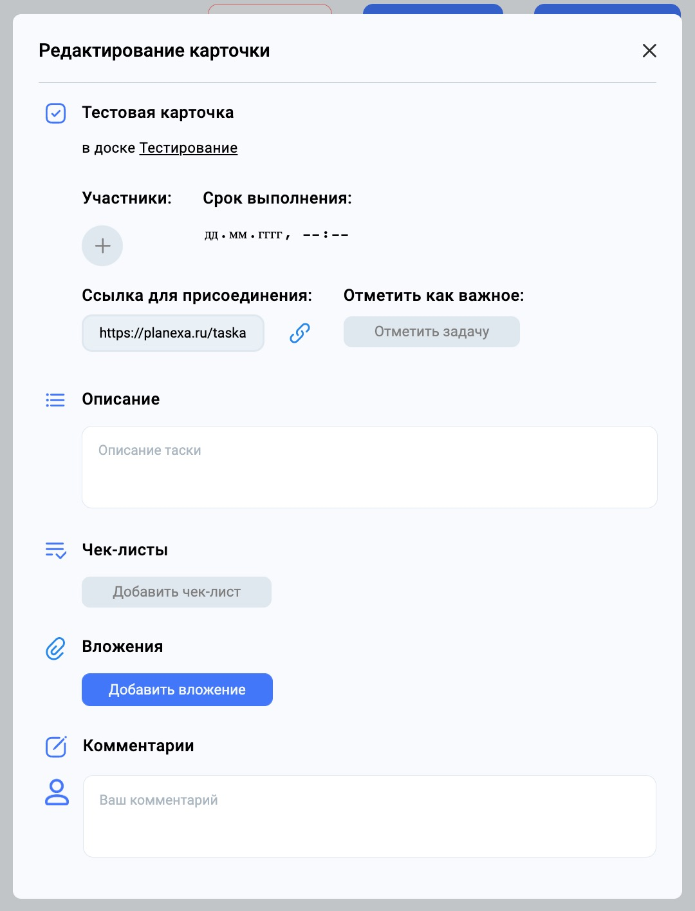

# Тестирование проекта

Ссылка на проект: [Planexa](https://planexa.ru)

## Тестовое окружение

Операционная системы: Mac OS Monterey 12.5.1 
CPU: 2,8 GHz@4 
RAM: 16 Gb 
Браузер: Google Chrome 105.0.5195.125 
Разрешение экрана: 13,3-дюймовый (2560 × 1600)

Тестируемая фича: Страница карточки

## Страница краточки

Ссылка (если залогинены, то можете присоединиться): 
[Карточка](https://planexa.ru/taskappend/ac3b08b8-a188-425e-b76c-c789cd64ce76)

- Поле "Название карточки"
  - по клику на инпут появляется полоса снизу
  - при снятии фокуса сохранение введенной информации
  - при нажатии на Enter происходит снятие фокуса и сохранении информации
  - автомасштабирование размера инпута по высоте в зависимости от контента
  - **Баг:** нет органичения длины инпута
    - Ожидаемое поведение: ограничение ввода по количеству символов
  - **Баг:** при вводе пустой строки информация не сохраняется (валидация на бэке работает, а на фронте нет)
    - Ожидаемое поведение: отображение ошибки о некорректной информации
  - допустимый ввод любых символов
  - html-теги не сохраняются
- Блок "Участники"
  - при наведении на кнопку "Плюс" появляется кебаб-меню возможных для добавления пользователей
  - при наведении на пользователя в списке затемняется задний фон
  - при нажатии на пользователя для добавления участник появляется под надписью "Участники"
  - при наведении на ранее добавленного пользователя появляется крестик
  - при наведении на ранее добавленного пользователя появляется тултип с ником пользователя
  - при нажатии на ранее добавленного пользователя происходит удаление пользователя с карточки
- Блок "Срок выполнения"
  - при наведении на поле меняется курсор на указатель
  - при нажатии на поле открывается встроенный в браузер календарь
  - при выборе даты в календаре меняется дата в поле
  - при удалении даты в календаре удаляется дата из поля
- Блок "Ссылка для присоединения"
  - при наведнии на кнопку "Цепь" меняется курсор на указатель
  - при нажатии на поле с ссылкой появляется синяя рамка у поля
  - при нажатии на кнопку "Цепь" меняется фокус на инпут и копируется поле
  - **Баг:** можно изменить/удалить ссылку в инпуте
    - Ожидаемое поведение: текст инпута менять нельзя
- Блок "Отметить как важное"
  - при наведении на кнопку меняется курсор на указатель
  - при нажатии на кнопку меняется цвет кнопки и надпись на "Задача отмечена"
  - при нажатии на ранее отмеченную важную задачу цвет кнопки и надпись меняются
  - **Баг:** задача автоматически отображается важной
    - Ожидаемое поведение: отображение в соответствие с пользовательскими данными
- Блок "Описание"
  - при нажатии на инпут появляется синяя рамка у поля
  - при снятии фокуса сохраняется введенная информация
  - при нажатии на Enter происходит снятие фокуса и сохранении информации
  - html-теги не сохраняются
  - ограничение длины вводимой информации от 0 до 150 символов
- Блок "Чек-листы"
  - Кнопка "Добавить чек-лист"
    - при наведении меняется курсор на указатель
    - при нажатии добавляется чек-лист и кнопка переезжает вниз
  - Поле "Название чек-листа"
    - по клику на инпут появляется полоса снизу
    - при снятии фокуса сохранение введенной информации
    - при нажатии на Enter происходит снятие фокуса и сохранении информации
    - **Баг:** нет органичения длины инпута
        - Ожидаемое поведение: ограничение ввода по количеству символов
    - **Баг:** при вводе пустой строки информация не сохраняется (валидация на бэке работает, а на фронте нет)
        - Ожидаемое поведение: отображение ошибки о некорректной информации
    - допустимый ввод любых символов
    - html-теги не сохраняются
  - Кнопка "Удалить чек-лист"
    - при наведении меняется курсор
    - при нажатии удаляется соответствующий чек-лист
  - Кнопка "Добавить элемент"
    - при наведении меняется курсор
    - при нажатии добавляется дефолтный пункт соответствующему чек-листу
  - Кнопка "Удалить пункт чек-листа"
    - при наведении меняется курсор
    - при нажатии удаляется соответствующий пункт чек-листа
  - Поле "Название элемента чек-листа"
    - по клику на инпут появляется полоса снизу
    - при снятии фокуса сохранение введенной информации
    - при нажатии на Enter происходит снятие фокуса и сохранении информации
    - **Баг:** нет органичения длины инпута
        - Ожидаемое поведение: ограничение ввода по количеству символов
    - **Баг:** при вводе пустой строки информация не сохраняется (валидация на бэке работает, а на фронте нет)
        - Ожидаемое поведение: отображение ошибки о некорректной информации
    - допустимый ввод любых символов
    - html-теги не сохраняются
  - Чек-бокс "Галочка"
    - при нажатии проставляется галочка
- Блок "Вложения"
  - Кнопка "Добавить вложение"
    - при наведении меняется курсор на указатель
    - при нажатии открывается диалоговое окно выбора файла
    - при выборе файла добавляется новый файл
    - **Баг:** нет ошибки при слишком большом размере файла
      - Ожидаемое поведение: должна быть ошибка о размере файла
  - Блок "Файл"
    - Кнопка "Скачать файл"
      - при наведении меняется курсор на указатель
      - при нажатии начинается загрузка файла на компьютер пользователя
    - Кнопка "Удалить файл"
      - при наведении меняется курсор на указатель
      - при нажатии удаляется файл
- Блок "Комментарии"
  - Поле "Ввод комментария"
    - при нажатии на инпут появляется синяя рамка у поля
    - при снятии фокуса сохраняется введенная информация
    - при нажатии на Enter происходит снятие фокуса и создание комментария
    - html-теги не сохраняются
    - **Баг:** нет ограничения вводимой информации по длине
      - Ожидаемое поведение: ограничение ввода по количеству символов
  - Поле "Изменения комментария"
    - по клику на инпут появляется полоса снизу
    - при снятии фокуса сохранение введенной информации
    - при нажатии на Enter происходит снятие фокуса и сохранении информации
    - **Баг:** нет органичения длины инпута
        - Ожидаемое поведение: ограничение ввода по количеству символов
    - **Баг:** при вводе пустой строки информация не сохраняется (валидация на бэке работает, а на фронте нет)
        - Ожидаемое поведение: отображение ошибки о некорректной информации
    - допустимый ввод любых символов
    - html-теги не сохраняются
    - **Баг:** не расширяется в зависимости от объема контента
      - Ожидаемое поведение: увеличение высоты в зависимости от объема контента
  - Кнопка "Удалить"
    - при наведении на кнопку меняется курсор на указатель
    - при нажатии на кнопку удаляется комментарий
    - кнопка видна только пользователю, создавшему комментарий
- Кнопка "Закрыть карточку"
  - при наведение на кнопку меняется курсор на указатель
  - при нажатии на кнопку закрывается карточка
